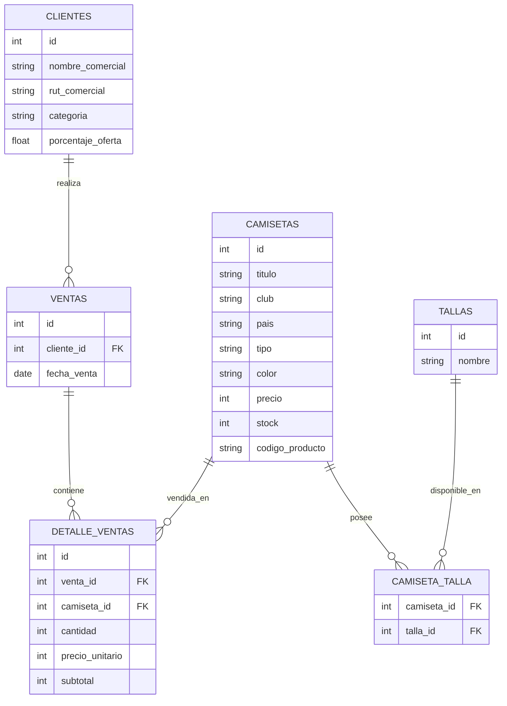

# TodoCamisetas API

[](https://laravel.com)
[](https://www.php.net)
[](https://www.docker.com)
[](LICENSE)

API REST desarrollada con **Laravel 11** para la gestión de ventas de camisetas deportivas. Administra clientes, camisetas, tallas y ventas con control de stock, descuentos automáticos y documentación OpenAPI/Swagger.

> ⚠️ **Sin autenticación implementada** — todos los endpoints son públicos. No desplegar a producción sin agregar autenticación.

---

## Índice

- [TodoCamisetas API](#todocamisetas-api)
  - [Índice](#índice)
  - [1. Requisitos Previos](#1-requisitos-previos)
  - [2. Levantar con Docker](#2-levantar-con-docker)
  - [3. Configurar variables de entorno](#3-configurar-variables-de-entorno)
  - [4. Ejecutar migraciones](#4-ejecutar-migraciones)
  - [5. Verificar que funciona](#5-verificar-que-funciona)
  - [6. Estructura de Carpetas](#6-estructura-de-carpetas)
    - [Capturas de la Estructura de Archivos](#capturas-de-la-estructura-de-archivos)
  - [7. Modelo de Datos](#7-modelo-de-datos)
  - [8. Endpoints de la API](#8-endpoints-de-la-api)
    - [Health Check](#health-check)
    - [Clientes](#clientes)
    - [Camisetas](#camisetas)
    - [Tallas](#tallas)
    - [Ventas](#ventas)
    - [Formato de respuesta](#formato-de-respuesta)
  - [9. Lógica de Negocio](#9-lógica-de-negocio)
    - [Validaciones destacadas](#validaciones-destacadas)
    - [Control de stock](#control-de-stock)
    - [Sistema de descuentos](#sistema-de-descuentos)
  - [10. Documentación Swagger](#10-documentación-swagger)
  - [Autores](#autores)

---

## 1. Requisitos Previos

- **Docker** y **Docker Compose** instalados y en ejecución
- **Git**

No se requiere PHP, Composer ni MySQL instalados localmente.

---

## 2. Levantar con Docker

```bash
# Clonar el repositorio
git clone https://github.com/joseFloresMoreno/exam_arancibia_flores_galvez
cd exam_arancibia_flores_galvez/backend

# Construir imágenes y levantar contenedores
docker compose up -d --build
```

**Servicios que se levantan:**

| Contenedor | Imagen | Puerto |
|---|---|---|
| `todocamisetas_app` | PHP 8.4-FPM + Composer | — (interno) |
| `todocamisetas_web` | Nginx 1.27-alpine | `8080:80` |
| `todocamisetas_db` | MySQL 8.0 | `3306:3306` |

---

## 3. Configurar variables de entorno

```bash
# Copiar archivo de ejemplo
docker compose exec app cp .env.example .env

# Generar clave de aplicación
docker compose exec app php artisan key:generate
```

El `.env.example` ya incluye la configuración correcta para Docker:

```env
APP_NAME='TodoCamisetas API'
APP_ENV=local
APP_DEBUG=true
APP_URL=http://localhost:8080

DB_CONNECTION=mysql
DB_HOST=db               # nombre del servicio Docker, no 127.0.0.1
DB_PORT=3306
DB_DATABASE=todocamisetas
DB_USERNAME=todocamisetas_user
DB_PASSWORD=todocamisetas_pass
```

---

## 4. Ejecutar migraciones

```bash
docker compose exec app php artisan migrate --seed
```

Esto crea todas las tablas: `clientes`, `camisetas`, `tallas`, `camiseta_talla`, `ventas`, `detalle_ventas`.

---

## 5. Verificar que funciona

```bash
# Health check
curl http://localhost:8080/api/health

# Listar camisetas
curl http://localhost:8080/api/camisetas

# Ver documentación Swagger
# http://localhost:8080/api/documentation
```

**Respuesta esperada del health check:**
```json
{
  "status": "ok",
  "message": "API is running",
  "timestamp": "2026-06-10T10:30:00Z"
}
```

**Comandos útiles de Docker:**
```bash
docker compose logs -f app       # Ver logs en tiempo real
docker compose exec app bash     # Acceder al shell del contenedor
docker compose restart app       # Reiniciar el servicio PHP
docker compose down              # Detener contenedores
docker compose down -v           # Detener y eliminar volúmenes (borra BD)
```

---

## 6. Estructura de Carpetas

```
backend/
├── app/
│   ├── Http/
│   │   ├── Controllers/          # Controladores REST
│   │   │   ├── CamisetaController.php
│   │   │   ├── ClienteController.php
│   │   │   ├── VentaController.php
│   │   │   ├── TallaController.php
│   │   │   ├── DetalleVentaController.php
│   │   │   ├── HealthController.php
│   │   │   └── Schemas/          # Anotaciones OpenAPI por recurso
│   │   └── Requests/
│   ├── Models/                   # Modelos Eloquent
│   │   ├── Camiseta.php
│   │   ├── Cliente.php
│   │   ├── Venta.php
│   │   ├── Talla.php
│   │   └── DetalleVenta.php
│   └── Traits/
│       └── ApiResponse.php       # Respuestas JSON estandarizadas
├── database/
│   ├── migrations/               # Migraciones de BD
│   ├── factories/                # Factories para testing
│   └── seeders/
├── docker/
│   ├── nginx/default.conf        # Configuración Nginx
│   └── php/Dockerfile            # Imagen PHP personalizada
├── routes/
│   └── api.php                   # Definición de rutas
├── storage/api-docs/             # Documentación Swagger generada
├── docker-compose.yaml
└── openapi-swagger.json          # Especificación OpenAPI
```

### Capturas de la Estructura de Archivos

Las siguientes imágenes muestran la estructura real del proyecto tal como aparece en el explorador de archivos:


---

## 7. Modelo de Datos



| Entidad | Descripción |
|---|---|
| **Clientes** | Clientes comerciales con categoría y descuento personalizado |
| **Camisetas** | Catálogo de productos con club, país, color y stock |
| **Tallas** | Tallas disponibles (XS, S, M, L, XL, XXL) |
| **Camiseta_Talla** | Relación muchos-a-muchos entre camisetas y tallas |
| **Ventas** | Cabecera de transacción (cliente + fecha) |
| **Detalle_Ventas** | Líneas de cada venta con cantidades y precios |

---

## 8. Endpoints de la API

### Health Check

| Método | Endpoint | Descripción |
|---|---|---|
| `GET` | `/api/health` | Estado del servicio |

### Clientes

| Método | Endpoint | Descripción |
|---|---|---|
| `GET` | `/api/clientes` | Listar todos los clientes |
| `POST` | `/api/clientes` | Crear cliente |
| `GET` | `/api/clientes/{id}` | Ver cliente |
| `PUT` | `/api/clientes/{id}` | Actualizar cliente |
| `DELETE` | `/api/clientes/{id}` | Eliminar cliente |
| `GET` | `/api/clientes/{id}/camisetas` | Camisetas compradas por el cliente |

### Camisetas

| Método | Endpoint | Descripción |
|---|---|---|
| `GET` | `/api/camisetas` | Listar todas las camisetas |
| `POST` | `/api/camisetas` | Crear camiseta |
| `GET` | `/api/camisetas/{id}` | Ver camiseta |
| `PUT` | `/api/camisetas/{id}` | Actualizar camiseta |
| `DELETE` | `/api/camisetas/{id}` | Eliminar camiseta |

### Tallas

| Método | Endpoint | Descripción |
|---|---|---|
| `GET` | `/api/tallas` | Listar tallas |
| `POST` | `/api/tallas` | Crear talla |
| `DELETE` | `/api/tallas/{id}` | Eliminar talla |

### Ventas

| Método | Endpoint | Descripción |
|---|---|---|
| `GET` | `/api/ventas` | Listar ventas |
| `POST` | `/api/ventas` | Crear venta |
| `GET` | `/api/ventas/{id}` | Ver venta |
| `PUT` | `/api/ventas/{id}` | Actualizar venta |
| `DELETE` | `/api/ventas/{id}` | Eliminar venta |

### Formato de respuesta

**Éxito:**
```json
{
  "status": "success",
  "message": "Operación completada exitosamente",
  "data": { ... }
}
```

**Error de validación:**
```json
{
  "status": "error",
  "message": "Validación fallida",
  "errors": {
    "nombre_comercial": ["El nombre comercial es requerido"]
  }
}
```

---

## 9. Lógica de Negocio

### Validaciones destacadas

- **Clientes**: RUT chileno (formato + dígito verificador), categoría válida (`Preferencial`, `Regular`), descuento 0–100%
- **Camisetas**: código de producto único, precio > 0, stock mínimo validado
- **Ventas**: stock suficiente antes de confirmar, cantidades positivas

### Control de stock

Al crear una venta el sistema verifica el stock disponible por camiseta y lo decrementa automáticamente dentro de una transacción atómica. Si no hay stock suficiente, la venta completa se rechaza.

### Sistema de descuentos

El descuento se aplica automáticamente al momento de crear la venta según el `porcentaje_oferta` del cliente:

```
precio_unitario = precio_camiseta * (1 - porcentaje_oferta / 100)
subtotal        = precio_unitario * cantidad
```

---

## 10. Documentación Swagger

La especificación OpenAPI está disponible en dos formas:

- **UI interactiva**: `http://localhost:8080/api/documentation`
- **Archivo JSON**: `backend/openapi-swagger.json`
- **Colección Postman**: `backend/TodoCamisetas API.postman_collection.json`

Para regenerar la documentación desde las anotaciones del código:

```bash
docker compose exec app php artisan l5-swagger:generate
```

---

## Autores

Proyecto desarrollado por **Ignacio Arancibia**, **José Flores** y **Jonathan Gálvez** — Instituto IPSS, 2026.
