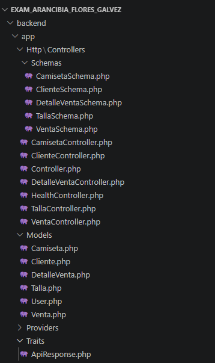
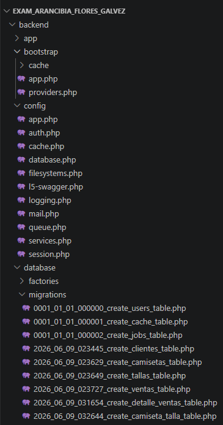
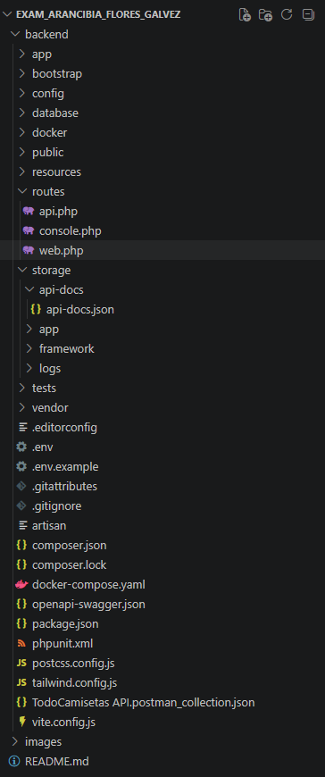
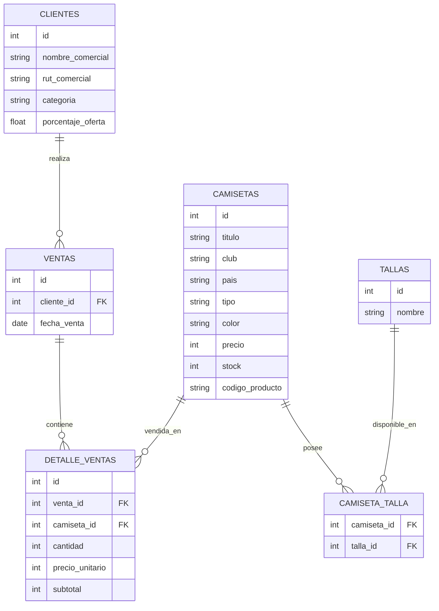

# TodoCamisetas API

API REST desarrollada con Laravel para la gestión de ventas de camisetas deportivas.

La aplicación permite administrar clientes, camisetas, tallas y ventas, incorporando control de stock, descuentos personalizados según cliente y documentación interactiva mediante OpenAPI/Swagger.

El sistema implementa una arquitectura basada en recursos REST, validación de datos en servidor, relaciones entre entidades y respuestas estandarizadas en formato JSON, facilitando su integración con aplicaciones web, móviles o sistemas de gestión externos.

## Estructura de Archivos

## Modelo de Datos

